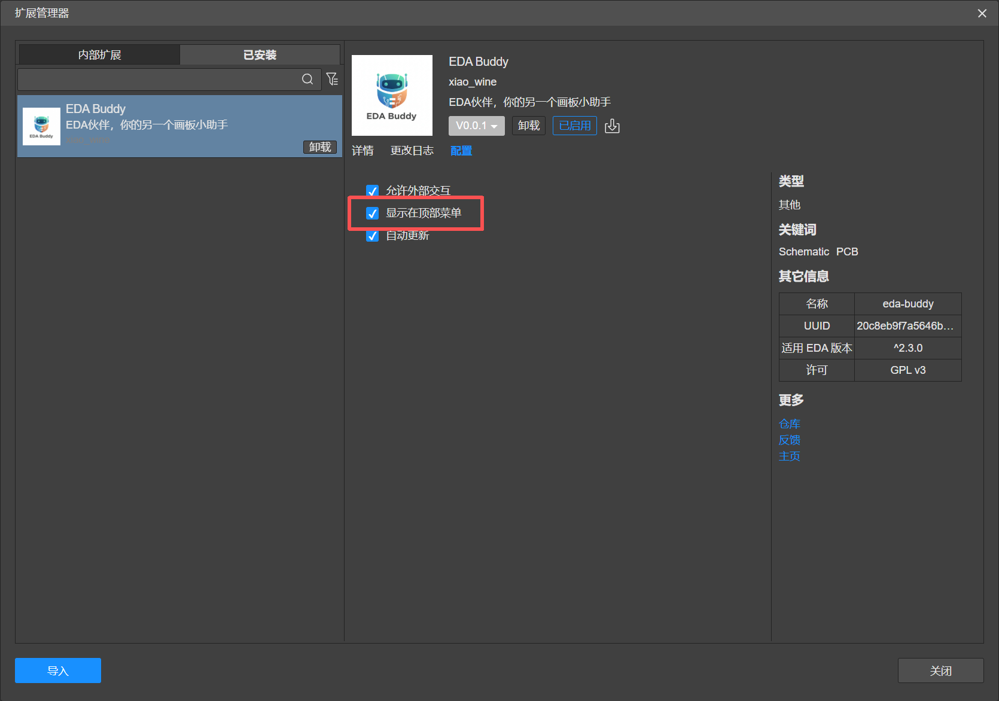
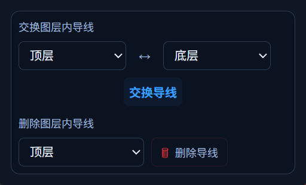

**项目概述**

导线层转易 是为嘉立创 EDA 开发的设计辅助插件，提供导线交换层功能，以及一键删除层导线功能

**使用说明**

- 对于在嘉立创EDA：
    - 直接点击安装即可
- 对于 Github:
    - 前往[Release](https://github.com/xiaowine/EasyLayer/releases)下载`easy-layer_vx.x.x.eext`文件  
      之后前往嘉立创顶栏->高级->扩展管理器->右下角导入，选择下载的文件进行安装

#### 使用小提示:在嘉立创 EDA 扩展管理器中勾选`显示在顶部菜单栏`以便快速访问插件功能。

**功能快速预览（深色模式截图）**

**贡献与反馈**

欢迎在[Github仓库](https://github.com/xiaowine/EasyLayer)提交 Issue/PR
提交前请运行现有 lint/格式化脚本并附上复现步骤。

或者前往[嘉立创扩展广场](https://ext.lceda.cn/item/xiao_wine/easy-layer)反馈建议与问题。

**许可证**

本项目采用 GPL v3 许可证。
